<p align="center">
  
</p>

<p align="center"><strong>A cricket speed gun on your Android phone that tells you when it doesn't know.</strong></p>

<p align="center">
  
  
  
  
  <a href="LICENSE"></a>
  
</p>

<h3 align="center"><a href="docs/JUDGES.md">Judges: how to try Paceball</a></h3>

<p align="center">
  Demo video (link to come) <!-- DEMO_VIDEO_URL: replace this line's text with [Demo video](DEMO_VIDEO_URL) -->
  &nbsp;·&nbsp;
  <a href="https://paceballpro.vercel.app">Website</a>
  &nbsp;·&nbsp;
  <a href="https://groups.google.com/g/paceball-testers">Google Play testing</a>
</p>

Built for RevenueCat Shipaton 2026.

## Screenshots

<table>
  <tr>
    <td align="center" valign="top">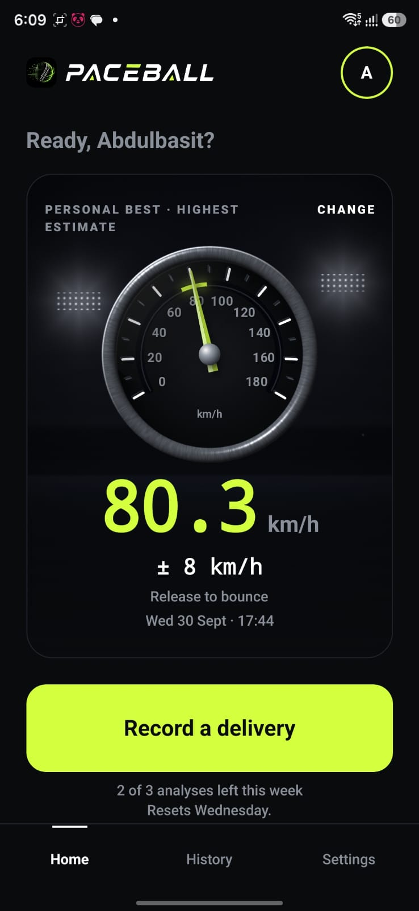<br><sub>Home: the personal best</sub></td>
    <td align="center" valign="top">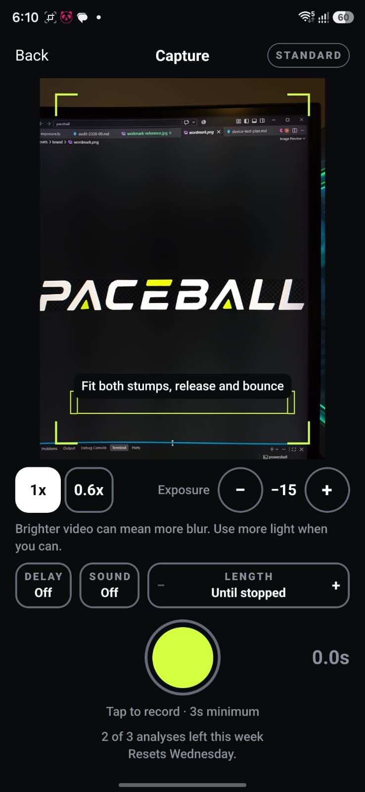<br><sub>Capture: live recording, 3 s minimum</sub></td>
    <td align="center" valign="top">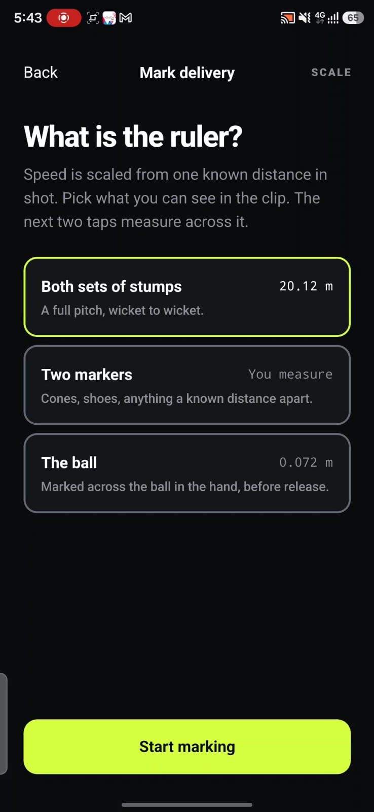<br><sub>Pick the ruler</sub></td>
    <td align="center" valign="top">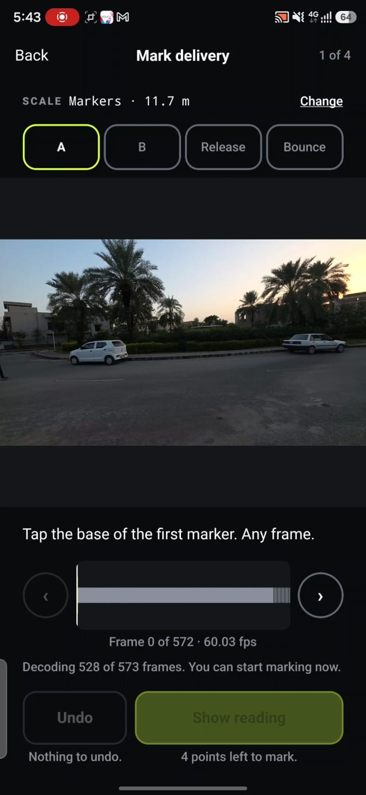<br><sub>Mark four points, frame by frame</sub></td>
  </tr>
  <tr>
    <td align="center" valign="top">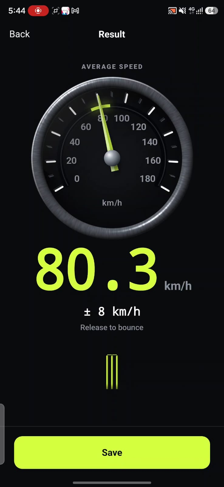<br><sub>Average speed with its ± range</sub></td>
    <td align="center" valign="top">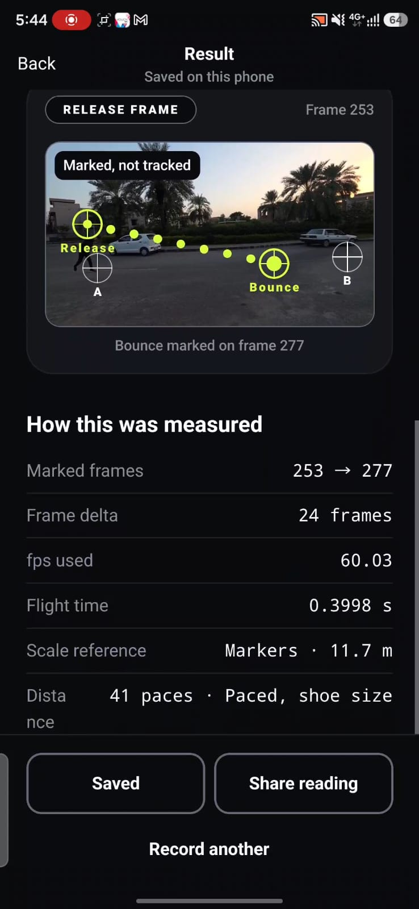<br><sub>How this was measured</sub></td>
    <td align="center" valign="top">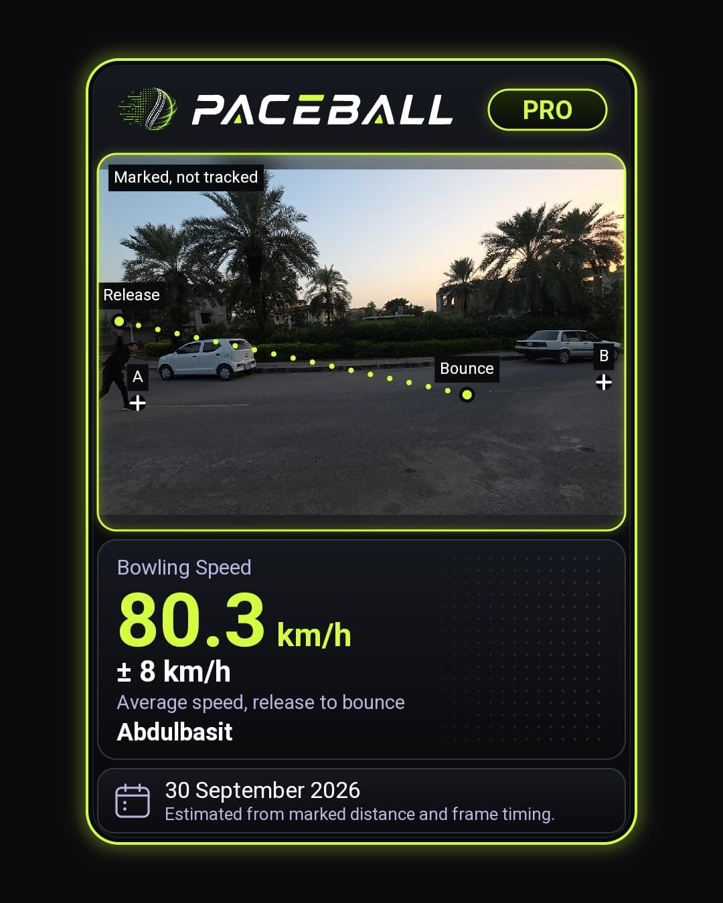<br><sub>Share card (Pro)</sub></td>
    <td align="center" valign="top">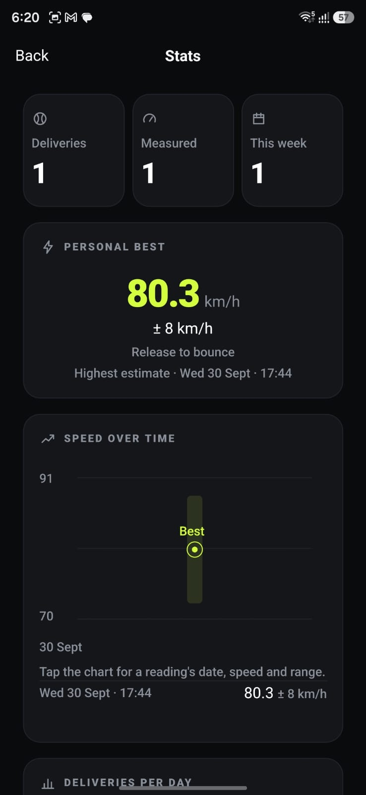<br><sub>Stats</sub></td>
  </tr>
  <tr>
    <td align="center" valign="top">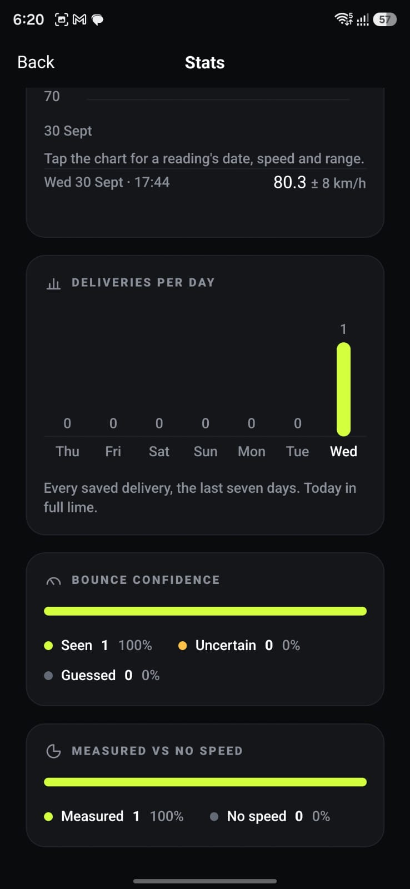<br><sub>Stats: bounce confidence</sub></td>
    <td align="center" valign="top">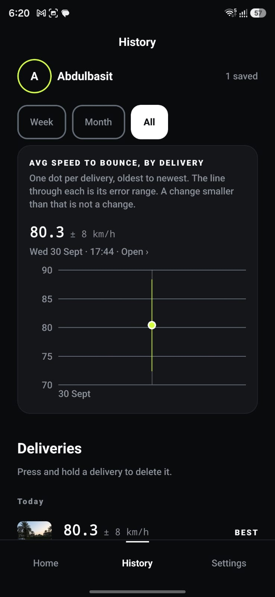<br><sub>History (Pro)</sub></td>
    <td align="center" valign="top">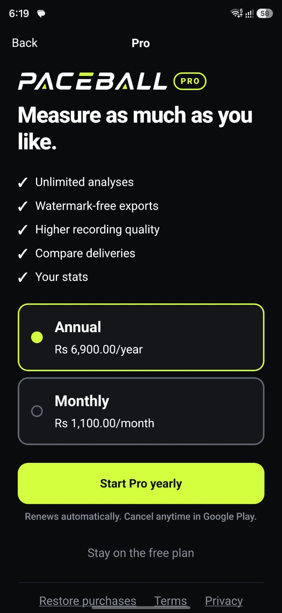<br><sub>Paywall: the store's prices</sub></td>
    <td></td>
  </tr>
</table>

### Free vs Pro

<table>
  <tr>
    <td align="center" valign="top">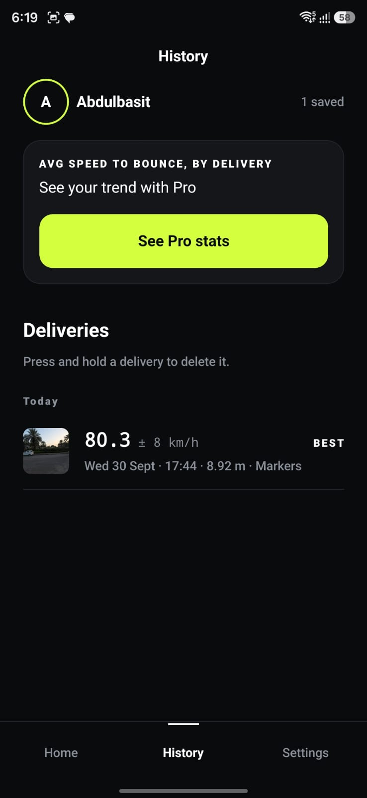<br><sub>Free: the list and the best, trend locked</sub></td>
    <td align="center" valign="top"><br><sub>Pro: every delivery's range on the trend</sub></td>
  </tr>
</table>

## What it does

Paceball measures how fast a cricket ball was bowled, from a video recorded on the phone.

1. **Record** the delivery side-on, live, for at least 3 seconds.
2. **Mark** four points: the two ends of a known distance (the ruler), then the ball at release and where it bounces.
3. **Read** the average speed from release to bounce, with the error range worked out for that one reading.

Everything runs on the phone. No account, no server of our own.

## How the measurement works

The scale comes from the ruler, not from an assumed pitch length. The ruler is both sets of stumps (20.12 m), two markers the user measured or paced out, or the ball itself (0.072 m).

```text
pixelsPerMetre = ruler length in pixels / ruler length in metres
travel (m)     = pixels between release and bounce / pixelsPerMetre
flight (s)     = frames between the marks / fps          (fps read from the video track, e.g. 60.03)
speed (km/h)   = travel / flight × 3.6
```

A real example, from the screenshots: 8.92 m in 24 frames at 60.03 fps is 0.3998 s, so 80.3 km/h.

The ± range matters because every term above is uncertain, and by different amounts on different deliveries. Four independent relative errors are combined in quadrature:

```text
relative² = (2 / frameDelta)²          which frame each mark landed on
          + refUncertainty²             the ruler's own length (stumps 0.5%, ball 1%, paced markers up to 5%)
          + (2σ / rulerPixels)²         tapping the ruler's ends, σ = 3 px
          + (2σ / travelPixels)²        tapping release and bounce
```

In the example, the markers were paced out from shoe size (5%) and the flight was 24 frames (about 8%), so the range comes out at ± 8 km/h. The same 3 px of marking error is 0.6% across stumps 1000 px apart and 50% across a ball 12 px wide, and the range says so. The code is in [`src/physics/`](src/physics/).

## Honesty rules

These are held by tests, not only by intention.

- **No seen bounce, no speed.** Every bounce mark says whether the ball was seen, uncertain or guessed. "Uncertain" widens the range. A guessed bounce gives no speed at all, and nothing measured from it is shown, exported or counted into a trend. The delivery can still be saved without a reading.
- **No speed without its range.** Every reading carries an error range worked out for that delivery from frame timing, the reference length and how precisely each mark could be placed. The app has no way to show a speed alone.
- **Implausible readings are flagged, never celebrated.** A reading over 180 km/h, or with a range wider than ± 25 km/h, is tagged "Check this reading" and never counts as a best.
- **Average speed, release to bounce.** That is what is measured, and it is always labelled that way. Release speed is higher, because the ball slows in the air.
- **Nothing that cannot be measured.** No spin, no RPM, no tracked flight path: the line on screen joins the two marks the user placed and says "Marked, not tracked".
- **A warning when the marks look wrong,** and when the reference was small in frame, which is an error the range cannot cover.
- **fps is read per file,** never assumed to be 60.

## Features

### Free

- Every measurement, with its ± range, and every ruler (stumps, markers, the ball)
- 3 analyses per 7-day period, counted from the first saved delivery
- History, the personal best, and the full "How this was measured" breakdown
- Share as an image card or a short video clip with the reading burned in. Free exports carry the translucent PACEBALL FREE band, and the card an upgrade bar
- Capture with a delay timer, a fixed length and optional sound

### Pro

- Unlimited analyses
- Clean exports: the image card and the video clip without the band
- Compare two deliveries side by side
- Stats: speed over time, deliveries per day, bounce confidence, and the History trend with each reading's range
- Higher recording quality on supported phones (a cleaner encode; the resolution and frame rate the measurement reads are the same)

## RevenueCat integration

| What | Where |
|---|---|
| SDK setup, offerings, purchase and restore. The key comes from `EXPO_PUBLIC_REVENUECAT_ANDROID_KEY`; the offering is `default`. | [`src/purchases/sdk.ts`](src/purchases/sdk.ts) |
| Pro is only ever the `pro` entitlement as RevenueCat reports it, never assumed. | [`src/purchases/entitlement.ts`](src/purchases/entitlement.ts) |
| Monthly and annual packages, and the trial length read from the store's introductory offer (the annual plan's 7-day free trial). | [`src/purchases/offering.ts`](src/purchases/offering.ts) |
| Live entitlement: a customer-info listener keeps Pro in step with the store. | [`src/purchases/PurchasesProvider.tsx`](src/purchases/PurchasesProvider.tsx) |
| The paywall: the store's own price strings, the trial when offered, terms, privacy and "Restore purchases". | [`app/paywall.tsx`](app/paywall.tsx) |
| Restore and "Manage subscription" in Settings > Pro. | [`app/settings.tsx`](app/settings.tsx) |
| A one-time celebration when a purchase confirms `pro` (never on a restore). | [`app/celebration.tsx`](app/celebration.tsx) |
| The free allowance: 3 analyses per 7-day period, anchored to the first saved delivery, across every player on the phone. | [`src/purchases/freeLimit.ts`](src/purchases/freeLimit.ts) |
| Every Pro gate in one place: analyses, clean exports, compare, stats, recording quality. | [`src/purchases/gates.ts`](src/purchases/gates.ts) |
| The paywall shown once at the end of onboarding. | [`src/purchases/onboarding.ts`](src/purchases/onboarding.ts) |
| A sample offering, only in a build with no RevenueCat key, labelled as a sample, with purchasing off. | [`src/purchases/mockOffering.ts`](src/purchases/mockOffering.ts) |

The paywall is reached from Capture (the weekly limit), the share sheet (the clean export), History (compare), Stats, Settings, and once at the end of onboarding. Prices are never written in the app or on the website: they are always the store's own strings, in the user's currency.

## Architecture

Expo SDK 57 and React Native 0.86, with expo-router for screens. VisionCamera v5 records. A local Kotlin module ([`modules/frame-extractor/`](modules/frame-extractor/)) reads the video track's own fps and frame count, and extracts exact frames with `MediaMetadataRetriever.getFramesAtIndex()`. The same module exports the video clip with Media3 Transformer. Skia draws the marks, the charts and the 3D scenes (runtime shaders, no WebGL), Reanimated drives the motion, and MMKV plus the file system hold everything on the phone.

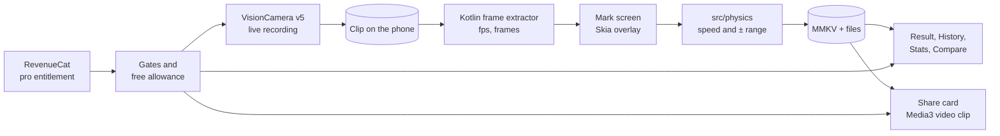

### Project structure

```text
app/                     Screens (Expo Router): home, setup, capture, mark, result,
                         analysis, history, compare, stats, settings, privacy, paywall
src/physics/             Calibration, speed and the uncertainty model
src/capture/             Recording and frame-extraction helpers
src/data/                On-phone storage (MMKV), validation, players and comparisons
src/export/              The share card, and the video clip's plan and share actions
src/purchases/           RevenueCat, the Pro entitlement and the weekly allowance
src/diagnostics/         Opt-in Sentry setup and its privacy filter
src/ui/                  Design tokens, shared components and the Skia 3D kit
src/settings/, src/types/ Preferences and shared types
modules/frame-extractor/ Local Kotlin module: video metadata, frames, Media3 export
assets/                  Launcher icon, brand and the intro
website/                 The public site (separate Next.js project, never imported)
tests/                   Node test suite
docs/                    Judges' guide, screenshots, design brief and test plans
```

## Privacy

Paceball never uploads videos or measurements, has no account, and runs the measurement on the phone. Deliveries are stored on the phone (MMKV and the app's files). Android's own backup may copy app data to the user's backup, and anything the user saves or shares can remain outside the app.

What can leave the phone, and when:

- **RevenueCat and Google Play, on every launch** of a build with a RevenueCat key: whether this phone has Pro, and the plans, their prices and any existing purchase. This check is not optional.
- **Google Play and RevenueCat, when subscribing or restoring:** the purchase, an anonymous ID and device details.
- **Sentry, only after opting in:** crash reports, as below.
- **Whatever the user chooses to share,** such as a result card.

Permissions: the camera; the microphone, optional, to keep the sound of the delivery (it measures the same without); and adding an image to the gallery when saving one. Reading the gallery is blocked in the manifest. Replays are muted by default on every clip, and exports are silent by default.

The in-app privacy screen and <https://paceballpro.vercel.app/privacy> say the same thing, and tests hold both to it.

### Crash reports

JavaScript and native crash reports are supported. Both are off by default, and nothing is sent unless the build carries a DSN and the user turns them on in the app.

- JavaScript reports pass through the allow-list in `src/diagnostics/privacy.ts`: reviewed static error messages only, no names, paths, breadcrumbs, screenshots or view hierarchy.
- Native reports come from Sentry's native SDK and may contain limited technical device and crash state that the app cannot filter. The in-app privacy screen says so.
- Development builds do not upload source maps (`SENTRY_DISABLE_AUTO_UPLOAD` in `eas.json`). `docs/sentry-setup.md` walks through the rest.

## Setup

### Prerequisites

- **Node.js 24** and npm (Codemagic builds on Node 24 too)
- **An Android phone** with Android 9 (API 28) or newer and USB debugging on. The camera, frame extraction and export need real hardware; an emulator cannot reproduce the recording workflow.
- For local builds: **Android Studio** with the Android SDK, and **JDK 17**
- For cloud builds: an **Expo account** (`npx eas-cli login`)

Paceball has native code, so **Expo Go cannot run it**. It runs in a development build.

### Install

```bash
git clone https://github.com/VisualsByBasit/paceball.git
cd paceball
npm ci
cp .env.example .env
```

`.env` is optional and never committed. Leave the values empty and the app still runs: with no RevenueCat key it treats everyone as free and shows a sample paywall, labelled as such, with purchasing off. To test real purchases, put your own RevenueCat public Android SDK key in `EXPO_PUBLIC_REVENUECAT_ANDROID_KEY`.

### Run a development build

Build the development client once and install it on the phone, either on this machine with the phone connected:

```bash
npx expo run:android --device
```

or in the cloud:

```bash
npx eas-cli build --profile development --platform android
```

Then, for every JavaScript change, start Metro for the installed client:

```bash
npx expo start --dev-client
```

### Production build

`eas.json` has three profiles: `development` (development client), `preview` (installable APK) and `production` (Play Store AAB).

- **EAS cloud:** `npx eas-cli build --profile production --platform android`
- **Codemagic:** [`codemagic.yaml`](codemagic.yaml) runs the same build on a Codemagic machine with `eas build --local`, so it uses no EAS build quota. It reads its secrets from a Codemagic environment group named `expo`, and saves `paceball.aab` as the artifact.

### Environment variables

Set these in `.env` for local builds, or in the EAS environment or the Codemagic group, never in the repository. Only the names are listed here; [`.env.example`](.env.example) has them with empty values.

| Name | What it does |
|---|---|
| `EXPO_PUBLIC_REVENUECAT_ANDROID_KEY` | RevenueCat's public Android SDK key. Turns on the real paywall, purchases and restores. |
| `EXPO_PUBLIC_SENTRY_DSN` | Sentry's public DSN. Makes optional crash reports available; nothing is sent until the user opts in. |
| `SENTRY_AUTH_TOKEN` | Build time only. Lets preview and production builds upload source maps to Sentry. |
| `SENTRY_ORG` | Build time only. The Sentry organisation the source maps go to. |
| `SENTRY_PROJECT` | Build time only. The Sentry project the source maps go to. |
| `EXPO_TOKEN` | CI only. An Expo access token, so a machine such as Codemagic can run EAS without logging in. |

**The app runs without any of them.** With no RevenueCat key it never contacts RevenueCat or Google Play, treats everyone as free, and shows a sample paywall labelled as a sample, with purchasing switched off. It never pretends a purchase happened. With no Sentry DSN, crash reporting says it is not available in this build and nothing is sent. Measuring, History, Analysis, the share card and the tests all work with no keys at all.

## Testing

```bash
npm test
npx tsc --noEmit
```

On 30 September 2026, `npm test` ran 454 tests, all passing. The suite covers the measurement and uncertainty model, storage and recovery, purchases and the weekly allowance, the privacy filter, exports, comparison, camera fallbacks, the screens' contracts, and the website's privacy claims and beta flow. A good run ends with no failures, and the typecheck prints nothing.

The website builds on its own:

```bash
cd website
npm ci
npm run lint
npm run build
```

## Known limitations

- **Android only.** There is no iOS build.
- **An average, not a radar reading.** The speed is the average from release to bounce. The ball leaves the hand faster, typically 5 to 8% faster, because it slows in the air.
- **Accuracy depends on the setup.** A still phone, side-on, with the ruler and the whole flight in frame gives a tight range; a small or paced ruler, or a short flight, gives a wide one. The range reports this, but it cannot cover marks placed on the wrong thing.
- **60 fps.** Phones expose 60 fps to apps, so a fast delivery covers only a couple of dozen frames. That is most of the range on a good setup.
- **Exported clip length.** Right after a video clip is exported, the in-app player can report a shorter length (about 1 s). Open it again from History a few minutes later and it shows the full length; the saved file is complete.
- **One player.** Player profiles exist in storage, but there is no screen to switch between them yet.

## Team

- **Abdulbasit**, founder, design and product
- **Mustafa Asim**, partner, lead developer

Built for RevenueCat Shipaton 2026.

## Licence

MIT. See [LICENSE](LICENSE).
